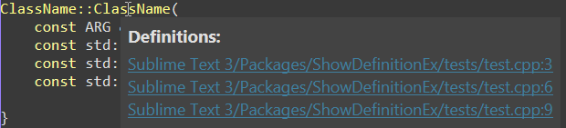
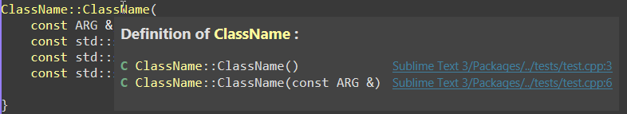

# Show Definition EX
ShowDefinitionEx expand original definition lookup path:line with class and  overloading choices

ShowDefinitionEx shows the definition of the function, not only path:line, but also the class name and function parameters.
It can be useful if there is a complex class hierarchy in the project, or if multiple function overloads are used in the project.
As for the built-in function of sublime, you can only see path:line of those relatated symbols, it's hard to decide which is what you want.

Basically, this package works on every syntax supported by your Sublime Text since it's base on the built-in function result, and open an invisible panel to parse the information of function.
It only shows symbols in the same file extention, so you will not see a JS function appear when writing C++

### Usage
Using `F10` to change between built-in method and this plugin

### Installation
Using `Package Control: Install Package` command and search for `ShowDefinitionEx`

### Demonstration
From

To

### Settings
	{
		"DEBUG": false,
		"show_path": true,
		// Scope name and file path will display on two lines
		// if length of scope name exceed this number
		"max_len_to_wrap": 60,
		// Manually setting parsing syntax
		"syntax_lists":
		[
			[
				"C++.sublime-syntax",
				[
					"h",
					"c",
					"hpp",
					"cpp"
				]
			]
		],
		// File that won't be show
		// "exclude_files":["css"],
		// Showing the same file type or both in related_list
		"related_list": [
			["h", "c", "hpp", "cpp"],
			["js", "css"]
		]
	}
